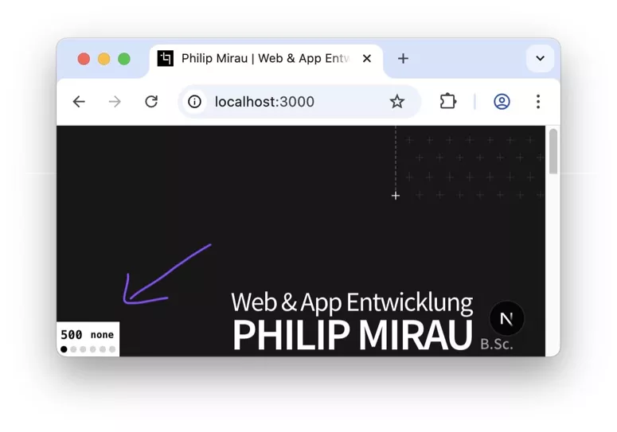

# React Dev Helpers

A collection of debug helpers and utilities that aid during React development.

## Installation

1. `npm i -D react-dev-helpers`

## Window Width

The WindowWidth component shows the current viewport width and active breakpoint in a small overlay at the bottom of the screen.
 

### Usage

```jsx
import { WindowWidth } from 'react-dev-helpers';

// ...

<WindowWidth
  breakpoints={[
    ['none', '0'],
    ['sm', '40rem'],
    ['md', '48rem'],
    ['lg', '64rem'],
    ['xl', '80rem'],
    ['2xl', '96rem'],
  ]}
/>
```



## DevOnly


This component renders its children only during development mode. `process.env.NODE_ENV` is ignored, when isDev is defined.

```jsx
import { DevOnly } from 'react-dev-helpers';

// ...

<DevOnly isDev={true}>I am visible</DevOnly>
<DevOnly isDev={false}>I am hidden</DevOnly>

// process.env.NODE_ENV is 'development'
<DevOnly>I am visible</DevOnly>
<DevOnly isDev={false}>I am hidden</DevOnly>

// process.env.NODE_ENV is 'production'
<DevOnly>I am hidden</DevOnly>

// ...
```
